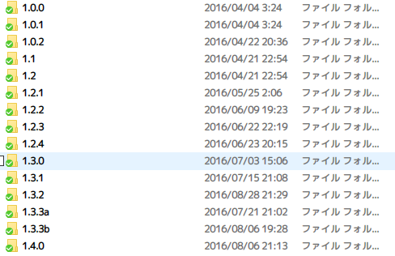
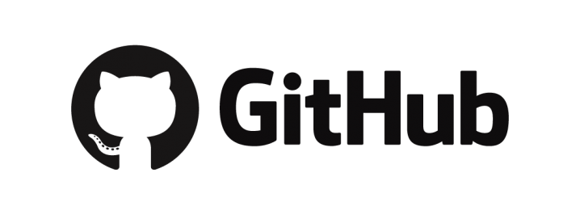

## 1. 間違ってもやり直せる、それがGit

---

### よくある光景

#### 中規模プログラムによくありがちなディレクトリ構造

|||

### よくある問題

- プログラムが動かなくなった！前に戻したいけど戻せない！
- グループワークで誰がどこをいじったのか分からない！
- 前までどの辺をコーディングしていたか忘れた！

---

### Gitとは？

- **ソースコードを管理するシステム**
- ソースコードの更新履歴を取り、「機能を追加した」「不要なコードを削除した」などコメントを付けて区切っていく
	- 動かなくなったら元に戻せる
	- 「誰がどの行をいじって何をしたのか」が分かる

|||

### GitHubとは？

- **Gitを使ってソースコードを管理するWebサービス**
- Web上に自分のソースコードを公開できる
- 進捗管理やWebページを公開できる仕組みもある

|||

### 開発者の必須サービスGitHub

- 多くのエンジニア、企業がGitHubを利用している
	- GitHubアカウント = エンジニアの名刺
- 無数のOSSがGitHubにある
	- OSS: オープンソースソフトウェア、ソースコードを公開しているソフトウェア
	- プログラミング言語、Windowsの一部のソフトウェア、Linuxなどがある
- グループワークを円滑に進める仕組みがある
- 簡単にWebページが公開できる仕組みがある
	- Webページを作る話はGit講座応用編で

---

### Git/GitHubは難しい？

|||

### A. 難しい

- 基本、コマンドで操作する
	- コマンドに慣れてない人にとって高い壁
- 環境構築に苦戦する (Windows限定)
- 用語が英語

|||

### 救世主: Visual Studio Code

- Microsoftのエディタ (2015年リリース)
- Windows / Mac / Linux対応
- 最初から便利な機能が備わっている
- **最もGitを簡単に操作できるクライアント**
	- GUIでほとんどの操作ができる
	- エディタ内からコマンドも打てる (ターミナル内蔵)

---

### まとめ

- Gitはソースコードを管理するシステム
	- 実装を間違ってもやり直すことができる
- GitHubはGitを使ったWebサービス
	- Gitの恩恵を受ける以外にも便利な機能がある
- 本講義ではコマンドを使わずにGitを操作する
